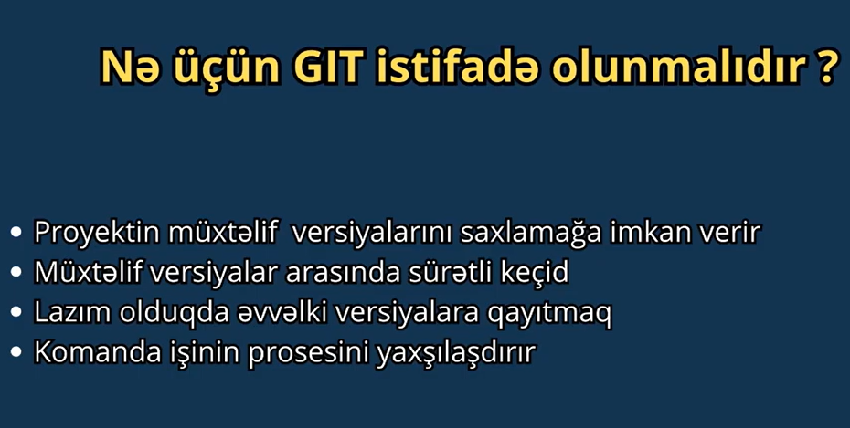

*Git => bizim versialar arasindaki keçid işlərini və etdiyimiz dəyişiklikləri uzaq bir servere əlavə etməyimizə köməklik edən bir alətdir(tooldu)

* GitHub => Bizim localdaki fayillari saxlayan Uzaqdaki server demek olar

* git init - .git uzantili Projevtle eyni path de folder yaradir (Local Repository)

* git config --global init.defaultBranch <branchName> => default branch-in adini dəyişmək => git config --global init.defaultBranch develop

* 

* 3 areas var => 1 Working directory(iş direktoriyasi) ".git uzantisi olan folderdi"- Biz gore Bilirik  bu areani , 2 Staging Area .git folderinin daxilinde olur, 
  3 Repository .git Folderinde olur bu bizim local repositoridi
* git init etdikde her fayil elave olunur Working directory-e , git add etdikde Staging Area , git commit etdikde Local Repository e

* 

* 

* 

* git add - Dəyişikləri Stage alanina əlavə edir

* git commit -m "Commit 1" - Dəyişikləri Local Repository -ə əlavə edir Stage dən çıxardıb .git -ə yazir 

* git status - Dəyiklikləri izləyir Aktiv olan Branch üzərindəki dəyiklikləri görsədir

* git reset HEAD <File Name> - Local Repositorideki dəyişiklikləri Stage Alanına daşıyır

* git resotere <File Name>  --stage - Local Repositorideki dəyişiklikləri Stage Alanına daşıyır 

* git branch <Branch Name> - Yeni bir branch yaradir

* git branch -a - Remote Repositorideki Branchlerin hamisini görsədir

* git checkout - Her hansisa Branch-ə getməmizi sağlayır

* git checkout -b <Branch Name> - yeni branch yaradib hemin branche getməmizi sağlayır

* git merge - isdediyimiz branchi hazirda olduqumuz branch ile birləşdirir
	      Eyni dosyada eyni setirde dəyişliklər olubsa hansini seçmek lazimdi diə önərilər edər

* git remote - Localdaki repositorimizi uzaqdaki repomuza baqlamaqimizi sağlayır
               yəni gitHub, gitLab kimi uzaq Repolara(Bir gitHub repozitorisi yaradiriq
               create new repositori və orda zatən Local Repomuzu Uzaqdaki gitHup Repo 
               ilə necə əlaqələndirmək lazimdi qeyd edilir) Deyisiklikleri elave etmir Local ile Remot daki Repolari baqlayir

* git clone - Uzaq serverdeki bir proyekti Kəndi komputerimizə indirməmizi sağlayır

* git pull - Uzaq serverdeki master branchindeki en son dəyiklikləri olduğumuz branchə indirməmizi sağlayır

* git push - Local Branchimizdəki dəyiklikləri Uzaq Serverdeki Repozitorimizə göndərir

*! WORKING DIRECTORY - "git add . (yaxud git add fileName)" dəyiklikləri Localdaki STAGE AREA əlavə edir 
 "git commit" dəyişiklikləri LOCAL REPOYA yəni .git -ə əlavə edir 
 "git push" LOCAL REPO daki yəni .git dəki dəyiklikləri REMOTE REPO-ya göndərir
 "git pull / git fetch" REMOTE REPO-dan LOCAL REPO-ya çəkir 
 "git merge" ederek LOCAL REPO-dan LOCAL WORKING DIRECTORY-ya Çəkir
 "git fetch + git merge = git pull"
 
*FORK - Hər hansisa Remote Reponu fork edirik sonra bu repo bizim Remote serverimize(gitHub Hesabimiza elave edilir) ondan sonra Komputerimizde
        git clone forklediyimizRepo(öz gitHubimizdaki url) sonra Dəyişkliklər etdim push etdim öz Remote Repoma sonrada ordan PR(pull request)
        yaradiriq sonrada Projectini forklediyimiz istifadeci merge edir

* GitHub Nədir ? - Projelərimizi Private və Public olaraq əlavə edə biləcəyimiz DEPOLAMA alanidir

* əgər bir faylda dəyişiklik edib git add ve commit etdikdə sonradan faylda dəyişiklik etdikdə birdə git add yazmaqa ehtuyac yoxdur 
  git commit yazmaq kiffayet edir(git commit -a -m "commit")

* git remote - "origin" 'gelecek origin git@github.com:gitUserName/RepositoryName.git' bu addressi saxlayir (Remote daki Reponun addressi)

* pull request => PR yaratmaq - yeni branch yaradib push etdikde hersey okeyse hemin branchi MR (MERGE REQUEST) edirik main branchimize sonrada yaratdiqimiz branchi silirik
  localdan silmek ichin ise terminalda   "git branch -d LocalBranchName"   Remote branchini silmekden ötri isə  "git push origin --delete remoteBranchnName"

* git branch m <old branch name> <new branch name> - branchin adini deyismek

* git log => hazirda olduqumuz branchdeki commitleri görə bilərik olurda hansisa fayil silinse yada nese deyisiklik silsek  
  biz git log ederek evelki commiti checkout ede bilerik "git checkout commit1 -- . " yada sol terefde fayili "discard changes" edirik 

* git diff => fayillarda edilen deyisikleri görsədir 

* git checkout -- fileName.uzantisi => eger fayilda sehfen edilen deyisiklikleri geri almaq isdeyirikse eger birden chox fayilsa adlarini qeyd etmekdense -- . qoya bilerik

* git reset HEAD fayilName.uzantisi => eger edilen deyisiklik add olub stage area düşibsə həmin dəyişiyliyi change alir yeni working area alir
  eger sonrada git checkout -- fileName.uzantisini yazarsaq bütün dəyişiklik geri alinacaq 

* git rm fileName.uzantisi => hemin fayli silir(fayil silmek) => fayl local Repoda(add commit) olsa da silir 

* git rm -r folderName/ => folder ve daxilindeki filelari silir  => folder local Repoda(add commit) olsa bile 

* git mv text.txt test.txt => text.txt faylin adi deyishib test.txt olur

* git mv text.txt folderName/ => foldere dashiyir ex: git mv text.txt dosya/ => dosya/text.txt  2) git mv text.txt dosya/abc.txt => dosya/abc.txt